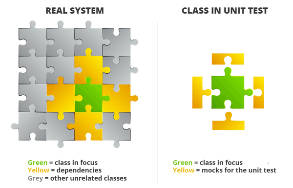
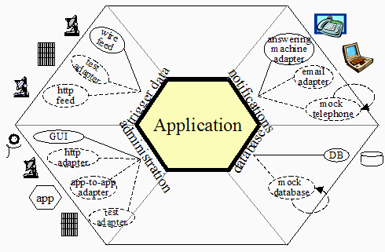
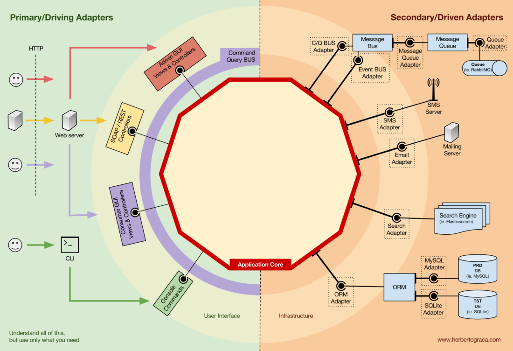
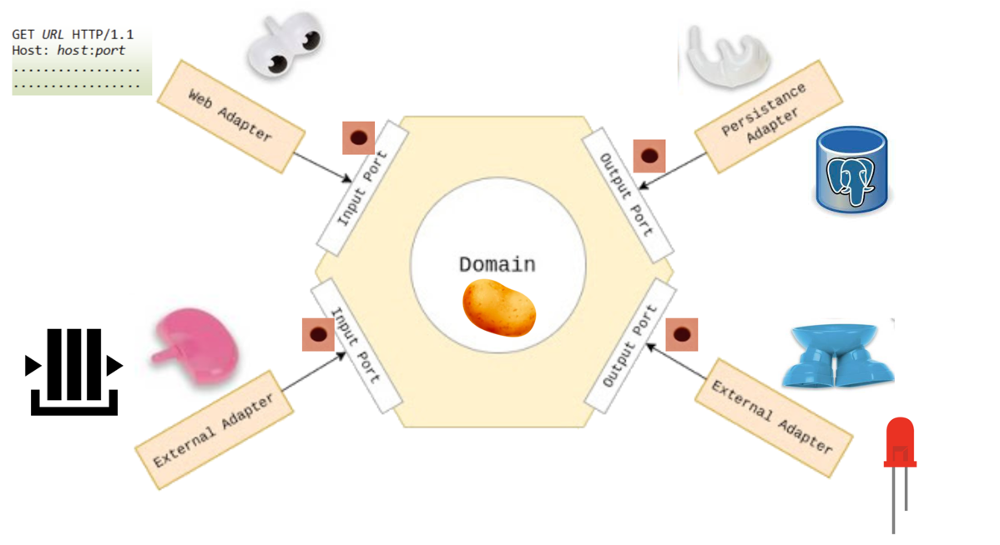

# hexagonal-multimodule
Example of an hexagonal service using multimodule (java , gradle). 

# Theory

## SOLID principles

Use https://www.digitalocean.com/community/conceptual-articles/s-o-l-i-d-the-first-five-principles-of-object-oriented-design. 

## Hexagonal architecture and Mr Potato

### Metaphors




### Real world





## Layers in hexagonal architecture

Let's put an example of a company that has just hired its first developer, who is you!. Let's talk about your journey in the company. 

### First week, knowing the company: Domain

**During first days**, before explaining you the software you must develop, they explain you the business. This is the domain, which represents the concepts of my business.

Examples:

- In my company, we have customers. They have a name and an age.
- Customers can have accounts, where they manage their money. 

You model it using **pure Java classes**. (We might use annotations for validation, for example, to avoid explicitly writing validation code, but never associated to infrastructure). 

### Second week: knowing that company needs from you: Application

In the second week, your PM explains what you need to develop. She has ambitious plans about the application, but she wants to start with something simple.

They explain to you that the functionalities (aka use cases) of your application are:

- Create a customer/Get customers list
- Create a bank account associated to a customer.
- Query current balance of an account.
- Add money to an account.
- 
#### Inbound/driving/primary ports, aka use cases. You Mr Potato's holes. 

Ports = entry or output points to the application. The are general-purpose (not specifically linked to a given infrastructure). Such as an USB-C port, that can be connected to an HP printer, an Bother printer, to a mouse, a keyboard or even a fan.


Each one of these functionalities can be developed using a different **vanilla-Java class**, this is why we call them **use cases**. These classes allow us to **drive** the application. 
Unfortunately, in the software world there are many ways to call these classes. The following are some of the names I have seen:

- **Use case**. 
- **Driving** port. Driving, because they drive the application. 
- **Inbound** port. Input, because they allow the application to **receive** (input) commands from the outer world. 
- **Primary** port. Primary, because they receive the first command from the outer world. Why them, the logic starts running. 
- **API** port, because an API allows to _drive_ an application. 

#### Outbound/driven/secondary ports. 

Once they explain that to you, you notice that you app will have **dependencies**, for example, on something _to store your customers._ 

You ask your architect and he says that there are lots of discussions about using relational or non-relational databases, but that you should not worry about that.

But your PM wants a review of the code in 2 weeks and says that the application will have more logic to develop in the future, so the sooner you have something, the better. 

Ok, so you decide to work on your code and abstract the database. You create an interface called `CustomerRepository`, not depending on the technology

    ```java
    public interface CustomerRepository {
        void save(Customer customer);
        Customer findById(String id);
    }
    ```

This class, that is, again, vanilla-Java, represents the **outbound port**. It is _general-purpose_ and it is not linked to a given technology (PostgreSQL, JSON, Mongo, XML, ...). 

And again, people use different names: 

- **Driven** port. Driving, because they are driven by the app. 
- **Outbound** port. Input, because they allow the app to **send** (output) commands to the outer world.
- **Secondary** port. Secondary, because they are called and the end of the logic execution, as a side effect of the logic. 
- **Dependency** port, because represent the dependencies of the application.

### 4th week: Infrastructure

The demo is tomorrow: you have implemented all the logic in the use cases, so your work is done, but the architects are still arguing over how many angels can dance on the head of a pin...

Ok, you only need to:

- Decide how to call you app, how to _drive_ it: let's use the simpler: from console. 
- Decide how to store customers: let's use a fake repository, where we store the users in memory.

#### Adapters. Your Mr Potato's pieces


In reality, what you are doing is to build the **infrastructure** of your app by creating the **adapters**. Definitions:

- An **primary adapter** is something implementing in a specific technology (HTTP Controller, SQS/Kafka Listener, keyboard listener) that calls a primary port (aka use case). 
- A **secondary adapter** is a specific implementation of a **secondary port**.

In this case, we have:

- The inbound/driving/primary/API adapter, which **calls** the use case/inbound/driving/primary/API port. 

```java
public class Application {
    private CreateCustomerUseCase useCase;
    public static void main(String[] args) {
        useCase.execute(new CreateCustomerRequest(args[0], args[1],...));
    }
}
```

- The outbound/driven/secondary/dependency adapter, which **implements** the outbound/driven/secondary/dependency port.

    ```java
  public class InMemoryCustomerRepository implements CustomerRepository {
      private Map<String, Customer> customer = new HashMap<>();
      public void save(Customer customer) {
          customers.put(customer.getId(), customer);
      }
      public Customer findById(String id) {
          return customers.get(id);
      }
  }
    ```
  
### 5th week: Leveraging my architecture

The architects agreed on a solution. They want to use PacoDB, a new trendy technology which only one of the architect knows. Its api is really complex.

Fortunately:
- The architect is willing to develop it. 
- You have already implemented the `CustomerRepository` interface.

So he only needs to implement the `CustomerRepository` interface, without changing any other case in your app.

```java
public class PacoDBCustomerRepository implements CustomerRepository {
    private PacoDBClient client;
    public void save(Customer customer) {
        //132456 lines of code to use that new technology. You don't have to worry about it. 
    }
    public Customer findById(String id) {
        //132456 lines of code to use that new technology
        return new Customer("Is is a normal customer, but retrieved using PacoDB");
    }
}
```

Additionally, they decide to use a REST API to call the app, and this is only you already learned in your 3 week HTTP course. So you can implement it. 

```java
public class RestCustomerController {
    private CreateCustomerUseCase useCase;
    
    @PostMapping("/customers")
    public void createCustomer(String name, int age) {
        useCase.execute(new CreateCustomerRequest(name, age));
    }
}
```

## Pros

- It is modular, you can easily plug and play different functionalities.
- It is easier for pairing and split. Eg. we develop the core together and then we split to implement the adapters.
- It satisfies SOLID.
- If our services becomes too big, it is easier to split.
- Each module has its dependencies.
- The better we express the domain, the easier will be for ChatGPT to understand it and help us. Eg. If you create a
  class with a single responsibility, maybe its name will be enough for ChatGPT to automatically create it.

## Cons

- Conversions
- You don't have to use hexagonal for everything. The architecture is a tool, not a goal.

## Summary

So summarise, this is our application architecture: 




**With hexagonal**


**Without it**


## References

- [Gradle multimodule](https://medium.com/@pkumarsaha71/how-to-create-a-multimodule-java-project-using-gradle-2689833712c7)


